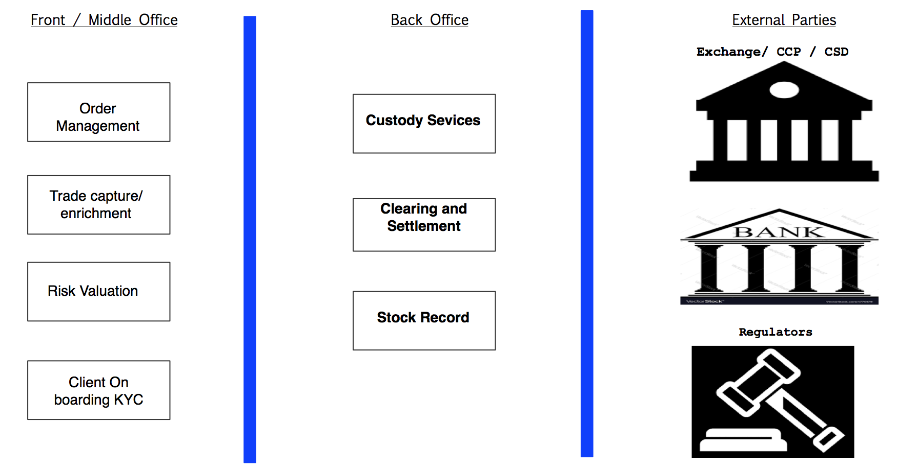
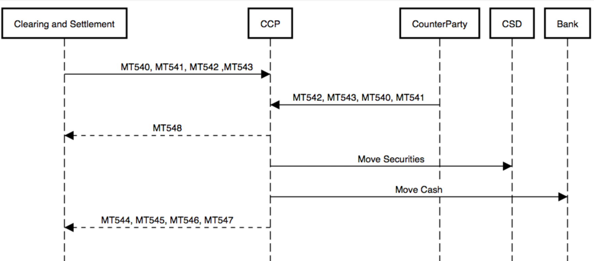

#  Investment banking Back office - A developer perspective.

Following article is concise explanation of investment back office. It briefs about essential functions.

Investment banking back office  essentially deals with cash and stocks. In order to understand Investment banking back office, it is better to split them into small functions. Typically, they can be sliced into  stock record, clearing and settlement, and custody services. Every bank needs to know what asset it holds and its quantity. Stock Record maintains this vital information. Bank has to interact with other financial institution like exchange or other banks for moving the asset. This function is referred as clearing and settlement. Once banks is in-charge for its customers asset, It needs to provide all the benefits of the asset like dividends, coupons or gift shares to the actual owner. Custody services function manages those corporate actions for the assets. 

## Following diagram shows where are the back office functions located.

## Stock Record
Any organization to be successful and efficient, It should be in control of its own goods and cash. Stock Record achieves that by maintaining current inventory or position of assets. For the brevity of the discussion, let’s take  traded and settled position. traded position means what has been agreed to buy or sell with exchange by order execution, that helps to predict the future movement of asset. settled position reflects actual security position in CSD (Central Security Depository) and cash in clients accounts. settled position gives what bank actually hold in every moment. 

Stock Record helps banks to lend money based on future position. For example, a hedge fund client executed an order to buy Singtel shares for 1 million. In Stock Record, it is receivable traded position, assuming that settlement happens in T + 3, bank can lend money based the predictive receipts of collateral. In this case, it is 1 million Singtel shares can be collateral.

Stock Records provides several key information like liquidity information wanted by the regulators, funding requirements for the cash accounts to avoid over due charges. It feeds banks general ledger for accounting    

## Clearing and Settlement

Clearing and settlement function moves the asset back and forth between investment bank and external parties like exchange or nostro agents(other bank). Once order to buy or sell a stock is executed in upstream(Front and Middle office), back office has responsibility to move ownership of asset. It has to pay money and receive the stocks or deliver the stocks and receive the money. Mostly, money and cash move in opposite direction. 

It’s most of the instruction to exchanges and other banks pass thru swift network. Every instruction goes thru Anti-money laundering(AML), Office of Foreign Asset Control(OFAC) check as well as any checks stipulated local regulators. Clearing and settlement generally happens thru Central Counter Party Clearing House (CCP) to avoid the credit risk. Clearing means matching  settlement instruction with CCP. Settlement means actual movement of ownership. Once settlement is done, It publishes information to Stock Record to rebalance its asset positions.

## Custody services
Custodial banks maintains client’s assets by getting fees. Issuer of the stocks pay dividends to the CSD which holds the asset, CSD in turn pay the asset to the Custodian banks, which in turn pays to the clients. Clients can give standing instruction to custodial bank for money it receive for dividend. like, credit to particular account, accumulate for particular tenure, invest in money market and etc. 

Corporation will split the shares when the price reaches it’s high value, in order to be more attractive for small investor. In such situations, Custody services interacts with CSD to get their splits for their customers. Two corporation could merge or single corporation spin off a new corporation. all these actions possible change the quantity of stocks. Custody services ensures all the corporate actions are taken care for it’s clients.

## How everything related?

1. Order becomes trade when it is executed in the market. Trade that is enriched with details for settlement reaches back office applications.
1. Stock Record creates or updates traded position.
1. Clearing and settlement function prepares settlement instruction for the trade and sends to exchange/CCP. Some cases, It directly pays money to counterparty by instructing the nostro agent. Mostly, settlement instructions will be in SWIFT
1. Exchange/CCP receives settlement instructions from parties involved.It matches them and informs clearing and settlement function.
1. Exchange/CCP debits money from bank account and credits stocks to the CSD or vice versa. It publishes settlement completion to involved parties.
1. Settlement and clearing function updates the status of settlement in Stock Record to make it reflect what is in CSD.
1. If Bank plays custodian role, it starts subscribing to the alerts of corporate action and takes necessary steps to service the asset.

