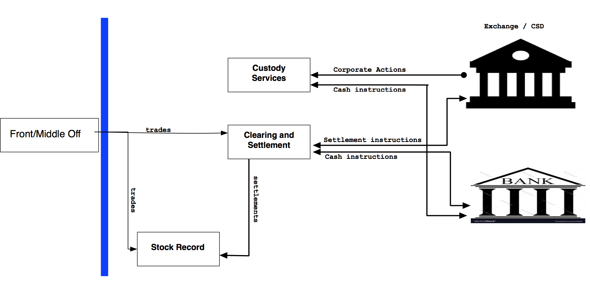

#  Investment banking Back office - A developer perspective.

Investment banking back office  essentially deals with cash and stocks. We can call them with common name "assets". In order to understand Investment banking back office, it is better to split them into small functions. Typically, they can be sliced into  asset record, asset movement and asset servicing. Every bank needs to know what asset it holds and its quantity. asset record maintains this vital information. Bank has to interact with other financial institution like exchange or other banks for moving the asset. This function is referred as asset movement. Once banks is in-charge for its customers asset, It needs to provide all the benefits of the asset to the actual owner. Asset servicing function manages corporate actions for the assets

## Asset Record
Any organization to be successful and efficient, It should be in control of its own goods and cash. Asset record achieves that by maintaining current inventory or position of assets. For the brevity of the discussion, let’s take  traded and settled position. traded position means what has been agreed to buy or sell with exchange by order execution, that helps to predict the future movement of asset. settled position reflects actual security position in CSD (Central Security Depository) and cash in clients accounts. traded position gives prediction for clients asset. 

Asset record helps banks to lend money based on future position. For example, a hedge fund client executed an order to to by Singtel shares for 1 million. In asset record, it is receivable traded position, assuming that settlement happens in T + 3, bank can lend money based the predictive receipts of collateral. In this case, it is 1 million Singtel shares

Asset records provides several key information. Liquidity information wanted by the regulators. Funding requirements for the cash accounts to avoid over due charges. It feeds banks general ledger for accounting    

## Asset Movement

Asset movements function as it name denotes, moves the asset back and forth between investment bank and external parties like exchange or nostro agents. Once order to buy or sell a stock is executed in upstream(Front and Middle office), back office has responsibility to move ownership of asset. It has to pay money and receive the stocks or deliver the stocks and receive the money. Mostly, money and cash move in opposite direction. 

It’s most of the instruction to exchanges and other banks pass thru swift network. Every instruction goes thru Anti-Money laundering(AML), Office of Foreign Asset Control(OFAC) check as well as any checks stipulated local regulators. Carrying out of clearing and settlement of the banks is important responsibility of the asset movement.These movements generally happens thru Central Counter Party Clearing House (CCP) to avoid the credit risk. asset movement function informs settlement to asset record to rebalance its asset positons.

## Asset Servicing
Custodial banks maintains client’s assets by getting fees. Issuer of the stocks pay dividends to the CSD which holds the asset, CSD in turn pay the asset to the Custodian banks, which in turn pays to the clients. Clients can give standing instruction to custodial bank for money it receive for dividend. like, credit to particular account, accumulate for particular tenure, invest in money market and etc. 

Corporation will split the shares when the price reaches it’s high value, in order to be more attractive for small investor. In such situations, Asset servicing interacts with CSD to get their splits for their customers. Two corporation could merge or single corporation spin off a new corporation. all these actions possible change the quantity of stocks. Asset servicing ensures all the corporate actions are taken care for it’s clients.

## How everything related?

